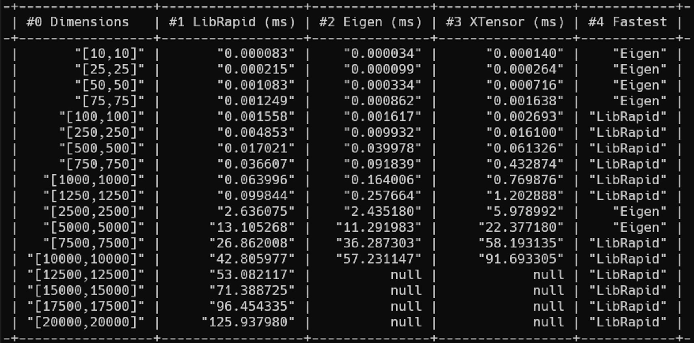

# Arithmetic

### Windows 10 -- Ryzen 9 3950x -- 64GB 3200MHz -- Using 8 threads
```cpp
-+-----------------+------------------+---------------+-----------------+------------+-
 | #0 Dimensions   | #1 LibRapid (ms) | #2 Eigen (ms) | #3 XTensor (ms) | #4 Fastest |
-+-----------------+------------------+---------------+-----------------+------------+-
 |       "[10,10]" |       "0.000107" |    "0.000042" |      "0.000206" |    "Eigen" |
 |       "[25,25]" |       "0.000250" |    "0.000140" |      "0.000347" |    "Eigen" |
 |       "[50,50]" |       "0.003703" |    "0.000480" |      "0.000891" |    "Eigen" |
 |       "[75,75]" |       "0.002929" |    "0.001072" |      "0.001899" |    "Eigen" |
 |     "[100,100]" |       "0.003163" |    "0.001888" |      "0.003134" |    "Eigen" |
 |     "[250,250]" |       "0.005644" |    "0.011716" |      "0.018203" | "LibRapid" |
 |     "[500,500]" |       "0.021646" |    "0.130774" |      "0.072358" | "LibRapid" |
 |     "[750,750]" |       "0.048431" |    "0.291689" |      "0.568692" | "LibRapid" |
 |   "[1000,1000]" |       "0.086192" |    "0.502987" |      "1.047861" | "LibRapid" |
 |   "[1250,1250]" |       "0.138163" |    "0.927572" |      "1.815688" | "LibRapid" |
 |   "[2500,2500]" |       "2.848979" |    "3.886852" |      "7.295377" | "LibRapid" |
 |   "[5000,5000]" |      "12.384536" |   "15.388336" |     "28.664203" | "LibRapid" |
 |   "[7500,7500]" |      "27.125923" |   "59.232746" |    "104.587155" | "LibRapid" |
 | "[10000,10000]" |      "47.090442" |   "88.874100" |    "151.946806" | "LibRapid" |
 | "[12500,12500]" |      "71.754428" |          null |            null | "LibRapid" |
 | "[15000,15000]" |      "99.746989" |          null |            null | "LibRapid" |
 | "[17500,17500]" |     "126.208696" |          null |            null | "LibRapid" |
 | "[20000,20000]" |     "167.313584" |          null |            null | "LibRapid" |
-+-----------------+------------------+---------------+-----------------+------------+-
```

### Windows 10 -- Ryzen 5 5600X -- 16GB 3600MHz -- Using 8 threads
